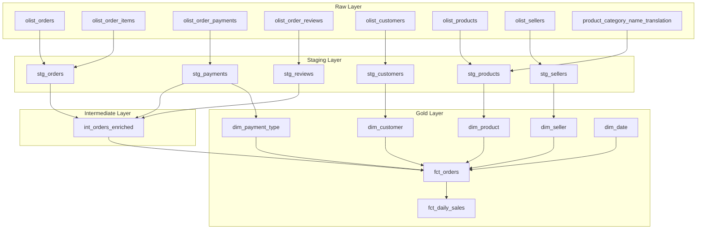

# Building a Local Star Schema Data Mart with dbt + DuckDB + Dagster + dlt

> End-to-End Modern Data Stack: dlt ingestion → dbt modeling → Dagster orchestration → Streamlit dashboard, built on a local DuckDB warehouse.

---

## Table of Contents

1. [Project Overview](#1-project-overview)
2. [Quick Start](#2-quick-start)
3. [Tech Stack and Design Choices](#3-tech-stack-and-design-choices)
4. [Architecture Design](#4-architecture-design)
5. [Project Layout](#5-project-layout)
6. [Implementation](#6-implementation)
   - [Environment Setup](#6-1-environment-setup)
   - [Raw Layer — Source Data Ingestion](#6-2-raw-layer--source-data-ingestion)
   - [Staging Layer — Type Casting and Cleansing](#6-3-staging-layer--type-casting-and-cleansing)
   - [Intermediate Layer — Business Logic](#6-4-intermediate-layer--business-logic)
   - [Gold Layer — Star Schema](#6-5-gold-layer--star-schema)
   - [Testing and Documentation](#6-6-testing-and-documentation)
   - [Dagster Orchestration](#6-7-dagster-orchestration)
   - [dlt — Declarative Data Ingestion](#6-8-dlt--declarative-data-ingestion)
   - [Streamlit Dashboard](#6-9-streamlit-dashboard)
7. [Retrospective](#7-retrospective)

---

## 1. Project Overview

**dbt_mini_mart** is a learning-oriented data mart project using Kaggle's [Brazilian E-Commerce Public Dataset by Olist](https://www.kaggle.com/datasets/olistbr/brazilian-ecommerce).

- 8 source CSV tables → **14 dbt models** → final **star schema** data mart
- 5 dimension tables (dim) + 2 fact tables (fct)
- 71 data quality tests + Dagster-based pipeline orchestration

### Source Data Structure

The Olist dataset consists of Brazilian e-commerce order data across 8 tables:

| Table | Description | Grain |
|-------|-------------|-------|
| `olist_orders` | Order header (status, timestamps) | order_id |
| `olist_order_items` | Order line items (price, freight) | order_id + order_item_id |
| `olist_order_payments` | Payment records (method, amount) | order_id + payment_sequential |
| `olist_order_reviews` | Reviews (score) | review_id |
| `olist_customers` | Customer master | customer_id |
| `olist_products` | Product attributes (category, weight) | product_id |
| `olist_sellers` | Seller master | seller_id |
| `product_category_name_translation` | Category name translation (PT → EN) | product_category_name |

---

## 2. Quick Start

### Prerequisites

- Python 3.11+
- [uv](https://docs.astral.sh/uv/) (Python package manager)

### 1) Clone and install dependencies

```bash
git clone https://github.com/kgeonhoe/dbt_mini_mart.git
cd dbt_mini_mart
uv venv && source .venv/bin/activate   # Windows: .venv\Scripts\activate
uv sync
```

### 2) Prepare Olist CSV data

Download from [Kaggle](https://www.kaggle.com/datasets/olistbr/brazilian-ecommerce) and place in `data/raw/`, or generate sample data:

```bash
uv run python scripts/generate_raw_csv.py
```

### 3) Load raw data into DuckDB (via dlt)

```bash
uv run python scripts/load_raw_dlt.py
```

### 4) Build dbt models + run tests

```bash
export DBT_PROFILES_DIR=$(pwd)     # Windows: $env:DBT_PROFILES_DIR = (Get-Location).Path
uv run dbt deps
uv run dbt build                   # 14 models + 71 tests (DAG order)
```

### 5) Launch Dagster UI

```bash
uv run dagster dev
# → http://localhost:3000 — 22 assets, end-to-end lineage
```

### 6) Launch Streamlit Dashboard

```bash
uv run streamlit run streamlit_app.py
# → http://localhost:8501 — 4 KPIs + 4 interactive charts
```

---

## 3. Tech Stack and Design Choices

### Full Stack

| Tool | Role | Version |
|------|------|---------|
| **dbt-core** | SQL modeling, testing, documentation | 1.8+ |
| **DuckDB** | Local OLAP warehouse | 1.0+ |
| **Dagster** | Pipeline orchestration | 1.12+ |
| **dlt** | Declarative data ingestion (EL) | 1.24+ |
| **Streamlit** | Dashboard / visualization | 1.55+ |
| **Plotly** | Interactive charts | 6.6+ |
| **uv** | Python dependency management | - |
| **dbt_utils** | Utility macros/test package | 1.1+ |

This project covers the full Modern Data Stack lifecycle — ingestion through visualization — using a lightweight local database.

dbt-DuckDB connection setup:
```yaml
# profiles.yml
mini_mart:
  target: dev
  outputs:
    dev:
      type: duckdb
      path: mini_mart.duckdb
      threads: 4
```

### Why Not dbt seed?

dbt seed works well for small reference tables, but bulk-loading tens of thousands of source rows via seed on every run is inefficient.

- In production, dbt seed is rarely used beyond small dimension tables.

This project **bulk-loads CSV files into DuckDB via dlt** and references them in dbt through `source()`:

```python
# scripts/load_raw_dlt.py (core logic)
@dlt.resource(name=table, write_disposition="replace", primary_key=None)
def _load_table(path, ts):
    for row in _read_csv_rows(path):
        row["_loaded_at"] = ts
        yield row
```

The **`_loaded_at` column is automatically added** to integrate with dbt's source freshness feature.

### Why Dagster?

Reasons for choosing Dagster over Airflow:

- **Asset-centric paradigm**: dbt models automatically map to Dagster Assets
- **dagster-dbt integration**: Manifest-based DAG auto-generation — no custom operator needed
- **Asset Catalog exposes dbt metadata**: Model descriptions, column info, SQL, and test status from schema.yml are directly visible in the Dagster UI. In Airflow, dbt runs as a plain task, so this metadata is not accessible from the orchestrator.
- **Local development friendly**: A single `dagster dev` command spins up the web UI and execution environment

---

## 4. Architecture Design

### 4-Layer Modeling (Layered Architecture)



**Role of each layer:**

| Layer | Materialization | Role |
|-------|----------------|------|
| **Raw** | Table (dlt load) | CSV → DuckDB bulk load via dlt. Auto-adds `_loaded_at` |
| **Staging** | View | Type casting, column renaming, simple joins |
| **Intermediate** | View | Combines multiple staging models, applies business logic |
| **Gold** | Table | Final star schema for analytics (dim + fct) |

### Star Schema Design

```
              dim_date
                 │
dim_customer ────┤
                 │
dim_product  ────┼──── fct_orders ──── fct_daily_sales
                 │                         (aggregated)
dim_seller   ────┤
                 │
dim_payment_type─┘
```

**fct_orders** (Grain: order item)
- 1 row = 1 order line item
- 5 dimension FKs: customer_id, product_id, seller_id, payment_type, date_key
- Measures: item_price, freight_value, gross_item_amount, payment_total_value, avg_review_score

**fct_daily_sales** (Grain: date + seller)
- Aggregated from fct_orders
- Measures: order_count, line_count, item_sales, freight_sales, gross_sales

### Grain Design Decision

The most critical design decision in this project was **setting the analysis grain to "order item"**.

In the Olist dataset, a single order (order_id) can contain multiple items. By choosing **order items (order_items)** as the grain instead of order headers (orders), per-product and per-seller analysis becomes possible.

The PK was designed as `order_line_id = order_id || '-' || order_item_id`, extracted into a macro:

```sql
-- macros/generate_order_line_id.sql

    concat({{ order_id_col }}, '-', cast({{ item_id_col }} as varchar))

```

---

## 5. Project Layout

```
models/
├── raw/
│   └── raw_sources.yml              # 8 source tables + freshness config
├── staging/
│   ├── stg_orders.sql               # Order-item join (grain change)
│   ├── stg_customers.sql            # Customer master
│   ├── stg_payments.sql             # Payment records
│   ├── stg_products.sql             # Products + EN category translation
│   ├── stg_reviews.sql              # Reviews (score only)
│   ├── stg_sellers.sql              # Seller master
│   └── stg_schema.yml               # Column descriptions + tests
├── intermediate/
│   ├── int_orders_enriched.sql      # Payment + review + item count merge
│   └── int_schema.yml
├── gold/
│   ├── dim_customer.sql
│   ├── dim_date.sql                 # date_spine (2016–2019)
│   ├── dim_payment_type.sql
│   ├── dim_product.sql
│   ├── dim_seller.sql
│   ├── fct_orders.sql               # Order-item grain fact
│   ├── fct_daily_sales.sql          # Daily seller aggregate fact
│   └── gold_schema.yml              # FK relationships + tests
└── docs.md                          # Grain & business logic doc blocks

dagster_mini_mart/                   # Dagster code location
├── project.py                       # DbtProject path config
├── assets.py                        # @dbt_assets definition
├── dlt_assets.py                    # dlt → @multi_asset (8 raw tables)
├── definitions.py                   # Definitions (assets + jobs + sensors)
├── jobs.py                          # dbt build / freshness / test jobs
└── alerts.py                        # Failure routing + alerting

scripts/
├── load_raw_dlt.py                  # dlt CSV → DuckDB pipeline
├── load_raw_to_duckdb.py            # Legacy Python loader (replaced by dlt)
└── generate_raw_csv.py              # Sample data generator

macros/
├── generate_order_line_id.sql       # PK macro
└── date_range.sql                   # Centralized date range

tests/
├── assert_daily_sales_reconciles.sql   # Fact reconciliation
├── assert_daily_line_count_matches.sql # Line count check
└── assert_orders_within_date_range.sql # Date range validation

streamlit_app.py                     # Dashboard (4 KPIs + 4 charts)
```

---

## 6. Implementation

### 6-1. Environment Setup

#### Python Environment (uv)

```bash
# Initialize project with uv
uv init dbt_mini_mart
cd dbt_mini_mart

# Add dependencies
uv add dbt-duckdb "duckdb>=1.0,<2.0"
uv add dagster dagster-dbt dagster-webserver
uv add "dlt[duckdb]" streamlit plotly
```

#### dbt Project Configuration

```yaml
# dbt_project.yml
name: mini_mart
version: 1.0.0
config-version: 2
profile: mini_mart

models:
  mini_mart:
    staging:
      +materialized: view       # Minimize transformation cost
      +schema: stg
    intermediate:
      +materialized: view       # Keep intermediate results as views
      +schema: int
    gold:
      +materialized: table      # Materialize final analytics layer
      +schema: gold
```

> **Materialization strategy**: Staging/Intermediate use views to reduce cost since they are simple transformations. Gold uses tables for analytics query performance.

#### Package Installation

```yaml
# packages.yml
packages:
  - package: dbt-labs/dbt_utils
    version: [">=1.1.0", "<2.0.0"]
```

```bash
dbt deps
```

Features used from `dbt_utils`:
- `date_spine()`: Generate dim_date
- `unique_combination_of_columns`: Composite PK uniqueness test
- `accepted_range`: Value range validation

---

### 6-2. Raw Layer — Source Data Ingestion

Since dbt seed is designed for small reference tables, source data is **bulk-loaded directly into DuckDB via dlt**.

```python
# scripts/load_raw_dlt.py (core)
@dlt.source(name="olist_raw")
def olist_raw_source(source_dir: Path):
    loaded_at = datetime.now(timezone.utc).isoformat()
    for table in RAW_TABLES:
        csv_path = _resolve_csv_path(table, source_dir)

        @dlt.resource(name=table, write_disposition="replace", primary_key=None)
        def _load_table(path=csv_path, ts=loaded_at):
            for row in _read_csv_rows(path):
                row["_loaded_at"] = ts
                yield row
        yield _load_table
```

**Design points:**

1. **Auto-adds `_loaded_at`** — Integrates with dbt source freshness
2. **`write_disposition="replace"`** — Full table replace on each run
3. **dlt auto-metadata** — `_dlt_load_id`, `_dlt_id` auto-generated for lineage

dbt references the raw layer via `source()`:

```yaml
# models/raw/raw_sources.yml
sources:
  - name: raw
    schema: raw
    loaded_at_field: _loaded_at
    freshness:
      warn_after: { count: 24, period: hour }
      error_after: { count: 72, period: hour }
    tables:
      - name: olist_orders
        columns:
          - name: order_id
            tests: [unique, not_null]
      # ... all 8 tables defined
```

Execution:

```bash
# Load CSV → DuckDB via dlt
uv run python scripts/load_raw_dlt.py

# Check freshness
dbt source freshness
```

---

### 6-3. Staging Layer — Type Casting and Cleansing

Staging principle: **Only reshape the source data's "form" — no business logic.**

#### stg_orders — Grain Change Is Key

```sql
-- models/staging/stg_orders.sql
with orders as (
    select * from {{ source('raw', 'olist_orders') }}
),
lines as (
    select * from {{ source('raw', 'olist_order_items') }}
)
select
    {{ generate_order_line_id('l.order_id', 'l.order_item_id') }}
        as order_line_id,
    o.order_id,
    o.customer_id,
    l.seller_id,
    cast(o.order_purchase_timestamp as timestamp) as order_purchase_ts,
    cast(o.order_purchase_timestamp as date)      as order_date,
    o.order_status,
    l.product_id,
    cast(l.order_item_id as integer) as order_item_id,
    cast(l.price as double)          as item_price,
    cast(l.freight_value as double)  as freight_value,
    cast(l.price as double) + cast(l.freight_value as double) as gross_item_amount
from lines l
join orders o on l.order_id = o.order_id
```

Key decisions here:
- **Inner join** between `olist_orders` (order header) and `olist_order_items` (line items)
- Grain changes from `order_id` → `order_line_id` (order item)
- Derived column `gross_item_amount = item_price + freight_value`

#### stg_products — Translation Table Join

```sql
-- models/staging/stg_products.sql
select
    p.product_id,
    p.product_category_name,
    t.product_category_name_english,   -- Portuguese → English
    cast(p.product_weight_g as integer) as product_weight_g,
    -- ...
from {{ source('raw', 'olist_products') }} p
left join {{ source('raw', 'product_category_name_translation') }} t
    on p.product_category_name = t.product_category_name
```

**LEFT JOIN is used** to avoid dropping products with untranslated categories.

#### Other Staging Models

| Model | Core Transformation |
|-------|-------------------|
| `stg_customers` | Cast zip_code as varchar (preserve leading zeros) |
| `stg_payments` | payment_value → double, payment_sequential → integer |
| `stg_reviews` | review_score → integer, exclude text comments |
| `stg_sellers` | Cast zip_code as varchar |

---

### 6-4. Intermediate Layer — Business Logic

`int_orders_enriched` combines multiple staging models to create derived columns for analysis.

```sql
-- models/intermediate/int_orders_enriched.sql (core logic)

-- 1. Total payment per order
payment_by_order as (
    select order_id, sum(payment_value) as payment_total_value
    from {{ ref('stg_payments') }}
    group by 1
),

-- 2. Primary payment type selection (highest amount)
payment_type_ranked as (
    select
        order_id, payment_type,
        row_number() over (
            partition by order_id
            order by sum(payment_value) desc, payment_type
        ) as rn
    from {{ ref('stg_payments') }}
    group by 1, 2
),

-- 3. Average review score per order
review_by_order as (
    select order_id, avg(cast(review_score as double)) as avg_review_score
    from {{ ref('stg_reviews') }}
    group by 1
),

-- 4. Item count per order
item_count as (
    select order_id, count(*) as order_item_count
    from base
    group by 1
)
```

**Derived columns summary:**

| Column | Logic | Default |
|--------|-------|---------|
| `payment_total_value` | Sum of all payments for the order | 0 |
| `primary_payment_type` | Payment method with highest total amount | 'unknown' |
| `avg_review_score` | Average review score for the order | NULL |
| `order_item_count` | Number of items in the order | — |

> **Design intent**: `primary_payment_type` handles the case where an order uses multiple payment methods. The method with the highest total amount is selected as the representative value. Ties are broken alphabetically by payment_type.

---

### 6-5. Gold Layer — Star Schema

The Gold layer constructs the final star schema. Materialization is set to **table** for analytics query performance.

#### Dimension Tables

| Dimension | Source | Grain | Notes |
|-----------|--------|-------|-------|
| `dim_customer` | stg_customers | customer_id | pass-through |
| `dim_product` | stg_products | product_id | Includes English category |
| `dim_seller` | stg_sellers | seller_id | pass-through |
| `dim_payment_type` | stg_payments | payment_type | DISTINCT extraction + label |
| `dim_date` | dbt_utils.date_spine | date_key | 2016-01-01 ~ 2019-01-01 |

**dim_date** uses `dbt_utils.date_spine()` with project-wide macros:

```sql
-- macros/date_range.sql

    cast('2016-01-01' as date)



    cast('2019-01-01' as date)

```

```sql
-- models/gold/dim_date.sql
with spine as (
    {{ dbt_utils.date_spine(
        datepart='day',
        start_date=date_range_start(),
        end_date=date_range_end()
    ) }}
)
select
    cast(date_day as date) as date_key,
    extract(year from date_day) as year_num,
    extract(month from date_day) as month_num,
    extract(day from date_day) as day_num,
    strftime(date_day, '%Y-%m') as year_month,
    case when extract(dow from date_day) in (0, 6) then true else false end as is_weekend
from spine
```

> **Centralizing the date range in macros** ensures dim_date and data validation tests reference the same range, preventing mismatches.

#### Fact Tables

**fct_orders** — Order item grain

```sql
-- models/gold/fct_orders.sql
select
    o.order_line_id,
    o.order_date          as date_key,       -- → dim_date
    o.customer_id,                            -- → dim_customer
    o.product_id,                             -- → dim_product
    o.seller_id,                              -- → dim_seller
    o.primary_payment_type as payment_type,   -- → dim_payment_type
    o.order_status,
    o.order_item_id,
    o.order_item_count,
    o.item_price,
    o.freight_value,
    o.gross_item_amount,
    o.payment_total_value,
    o.avg_review_score
from {{ ref('int_orders_enriched') }} o
```

**fct_daily_sales** — Daily seller aggregation

```sql
-- models/gold/fct_daily_sales.sql
select
    date_key,
    seller_id,
    count(distinct order_id) as order_count,
    count(*)                 as line_count,
    sum(item_price)          as item_sales,
    sum(freight_value)       as freight_sales,
    sum(gross_item_amount)   as gross_sales
from {{ ref('fct_orders') }}
group by 1, 2
```

---

### 6-6. Testing and Documentation

#### Testing Strategy (71 tests)

This project uses **3 types of tests**:

**1) Generic Tests (Schema Tests)** — 63

Declaratively defined in each model's `_schema.yml`:

```yaml
# models/gold/gold_schema.yml (example)
models:
  - name: fct_orders
    columns:
      - name: order_line_id
        tests: [unique, not_null]
      - name: customer_id
        tests:
          - relationships:
              to: ref('dim_customer')
              field: customer_id
      - name: item_price
        tests:
          - dbt_utils.accepted_range:
              min_value: 0
```

Test types breakdown:

| Type | Count | Example |
|------|-------|---------|
| unique / not_null | 20+ | PK integrity |
| relationships | 5 | FK referential integrity (fct_orders → 5 dims) |
| accepted_values | 2 | payment_type allowed values |
| accepted_range | 6 | Amount >= 0, review score 1~5 |
| unique_combination_of_columns | 1 | fct_daily_sales composite PK |

**2) Source Freshness** — 8

```yaml
freshness:
  warn_after: { count: 24, period: hour }
  error_after: { count: 72, period: hour }
```

Applied to all raw tables. Monitors data freshness based on the `_loaded_at` column.

**3) Singular Tests (Custom Validations)** — 3

```sql
-- tests/assert_daily_sales_reconciles.sql
-- Validates reconciliation between fct_daily_sales and fct_orders totals
with daily as (
    select sum(gross_sales) as total from {{ ref('fct_daily_sales') }}
),
orders as (
    select sum(gross_item_amount) as total from {{ ref('fct_orders') }}
)
select *
from daily cross join orders
where abs(daily.total - orders.total) > 0.01   -- tolerance for floating point
```

| Test | Validation |
|------|-----------|
| `assert_daily_line_count_matches` | fct_daily_sales line_count sum = fct_orders total rows |
| `assert_daily_sales_reconciles` | fct_daily_sales gross_sales sum = fct_orders gross_item_amount sum |
| `assert_orders_within_date_range` | All order dates fall within dim_date range (2016~2019) |

#### Documentation

dbt docs blocks keep business context alongside code:

```markdown
<!-- models/docs.md -->

The grain of this model is **order line (order item)**.
A single order (order_id) can contain multiple items.
`order_line_id = order_id || '-' || order_item_id` serves as the PK.



An order can use multiple payment methods.
`primary_payment_type` selects the method with the highest payment total.
Ties are broken alphabetically by payment_type.

```

```bash
dbt docs generate && dbt docs serve
```

---

### 6-7. Dagster Orchestration

dbt models are automatically mapped to Dagster Assets, enabling DAG visualization and execution from the web UI.

#### Project Setup

```python
# dagster_mini_mart/project.py
from dagster_dbt import DbtProject

dbt_project = DbtProject(
    project_dir=DAGSTER_DBT_PROJECT_DIR,
    target_path=DAGSTER_DBT_PROJECT_DIR / "target",
)
dbt_project.prepare_if_dev()
```

#### Asset Definition

```python
# dagster_mini_mart/assets.py
from dagster import AssetExecutionContext
from dagster_dbt import DbtCliResource, dbt_assets

@dbt_assets(manifest=dbt_project.manifest_path)
def dbt_mini_mart_dbt_assets(context: AssetExecutionContext, dbt: DbtCliResource):
    yield from dbt.cli(["build"], context=context).stream()
```

The `@dbt_assets` decorator reads the dbt manifest to auto-generate **14 dbt models + 8 sources = 22 Dagster Assets**. `dbt build` runs model builds and tests in DAG order.

#### Asset Catalog — How dbt Metadata Surfaces in Dagster UI

When `@dbt_assets(manifest=...)` parses the manifest, it reads descriptions, column info, test lists, and raw SQL from dbt schema.yml and registers them as Dagster Asset metadata.

This means the Dagster UI Asset Catalog shows:

- Per-model **Description** (including docs blocks)
- **Raw SQL** source
- Per-column descriptions and **Generic Data Tests** status

— all without opening the code repository.

In Airflow, dbt runs as a task through `BashOperator` or Cosmos, and model-level descriptions, SQL, and test metadata are not exposed in the Airflow UI. This difference was one of the most practical reasons for choosing Dagster for a dbt project.

#### Definitions

```python
# dagster_mini_mart/definitions.py
defs = Definitions(
    assets=[dlt_raw_ingest, dbt_mini_mart_dbt_assets],
    jobs=[dbt_build_job, dbt_source_freshness_job, dbt_test_modified_job],
    sensors=[routed_failure_sensor],
    resources={
        "dbt": DbtCliResource(project_dir=dbt_project),
    },
)
```

The dlt ingestion asset (`dlt_raw_ingest`) and dbt model assets are registered in a single Definitions, enabling end-to-end **ingestion → transform → gold** lineage visibility in the Dagster UI.

#### Execution

```bash
dagster dev
# → http://localhost:3000 to view and run the Asset DAG
```

---

### 6-8. dlt — Declarative Data Ingestion

The original `load_raw_to_duckdb.py` used plain Python + DuckDB SQL to load CSVs. This was replaced with **dlt (data load tool)** to build a declarative EL (Extract-Load) pipeline.

#### Why dlt?

| Aspect | Python Script | dlt |
|--------|--------------|-----|
| Schema management | Manual (`CREATE TABLE`) | Auto-inferred + evolution |
| Metadata | None | `_dlt_load_id`, `_dlt_id` auto-added |
| Load strategy | Manual implementation | Declarative `write_disposition` (`replace`, `append`, `merge`) |
| Dagster integration | Wrap in op/job | Natural mapping to multi-asset |
| Extensibility | Write SQL for each new source | Just add a `@dlt.resource` |

#### dlt Pipeline Implementation

```python
# scripts/load_raw_dlt.py (core)

@dlt.source(name="olist_raw")
def olist_raw_source(source_dir: Path):
    loaded_at = datetime.now(timezone.utc).isoformat()

    for table in RAW_TABLES:
        csv_path = _resolve_csv_path(table, source_dir)

        @dlt.resource(name=table, write_disposition="replace", primary_key=None)
        def _load_table(path: Path = csv_path, ts: str = loaded_at):
            rows = _read_csv_rows(path)
            for row in rows:
                row["_loaded_at"] = ts    # dbt source freshness integration
                yield row

        yield _load_table

pipeline = dlt.pipeline(
    pipeline_name="olist_raw_load",
    destination=dlt.destinations.duckdb(str(DB_PATH)),
    dataset_name="raw",
)
load_info = pipeline.run(olist_raw_source(source_dir=source_dir))
```

**Design points:**

1. **`@dlt.source` + `@dlt.resource`**: 8 CSV tables defined declaratively. Adding a new table means just one line in `RAW_TABLES`
2. **`write_disposition="replace"`**: Full replace on each run — suitable for batch pipelines with infrequent source changes
3. **Manual `_loaded_at`**: Explicit UTC timestamp for dbt source freshness compatibility
4. **dlt auto-metadata**: `_dlt_load_id` (load batch tracking) and `_dlt_id` (row unique ID) are auto-generated for data lineage

#### Dagster Multi-Asset Integration

The dlt pipeline is wrapped as a Dagster `@multi_asset`, making each of the 8 raw tables appear as individual assets in the Dagster UI.

```python
# dagster_mini_mart/dlt_assets.py (core)

_outs = {
    table: AssetOut(key=["raw", table], group_name="ingestion", is_required=False)
    for table in RAW_TABLES
}

@multi_asset(name="dlt_raw_ingest", outs=_outs, compute_kind="dlt", can_subset=True)
def dlt_raw_ingest(context):
    _drop_raw_tables()                          # Clean existing tables
    pipeline = dlt.pipeline(...)
    load_info = pipeline.run(_olist_raw_source())

    selected = context.selected_output_names    # Subset execution support
    for table in RAW_TABLES:
        if table not in selected:
            continue
        count = _row_count(table)
        yield MaterializeResult(
            asset_key=["raw", table],
            metadata={"row_count": MetadataValue.int(count)},
        )
```

This integration enables end-to-end lineage in the Dagster UI:

```
[dlt] raw/olist_orders     →  [dbt] stg_orders     →  int_orders_enriched  →  fct_orders
[dlt] raw/olist_customers  →  [dbt] stg_customers   →                         dim_customer
[dlt] raw/olist_products   →  [dbt] stg_products    →                         dim_product
...                                                                            fct_daily_sales
```

#### Troubleshooting

Key issues encountered during dlt + Dagster integration (documented in `docs/dlt_dagster_troubleshooting.md`):

| Issue | Cause | Resolution |
|-------|-------|------------|
| DuckDB cannot ADD NOT NULL column | dlt metadata columns (`_dlt_id`, etc.) ALTER on existing tables | DROP existing tables before pipeline run |
| `dev_mode=True` changes schema name | Appends timestamp suffix to dataset name | Remove `dev_mode` to fix schema name |
| Dagster context type hint rejected | Dagster 1.12 multi_asset type annotation incompatibility | Remove type annotation |
| Subset materialize asset key mismatch | MaterializeResult yielded for non-selected assets | Filter with `context.selected_output_names` |

---

### 6-9. Streamlit Dashboard

The dbt gold layer data is visualized with **Streamlit + Plotly**, providing an interactive analytics dashboard.

#### Architecture

```
DuckDB (main_gold schema)
    │
    ├── fct_orders          ─┐
    ├── fct_daily_sales      │
    ├── dim_customer         ├──→  Streamlit App  ──→  http://localhost:8501
    ├── dim_product          │
    ├── dim_payment_type    ─┘
    └── dim_seller
```

Streamlit connects **directly to DuckDB in read-only mode**. No intermediate data store or API server — gold tables are queried directly.

#### Dashboard Layout

**KPI Cards** (top row):

| Metric | Source |
|--------|--------|
| Order Count | `count(DISTINCT order_id)` from fct_orders |
| Order Items | `count(*)` from fct_orders |
| Total Revenue | `sum(gross_item_amount)` from fct_orders |
| Avg Review Score | `avg(avg_review_score)` from fct_orders |

**4 Charts** (DE Zoomcamp requires 2+):

| # | Chart | Type | Data Source |
|---|-------|------|-------------|
| 1 | 📈 Daily Sales Trend | Area (temporal) | `fct_daily_sales` — gross_sales by date_key |
| 2 | 💳 Payment Method Distribution | Donut (categorical) | `fct_orders` × `dim_payment_type` |
| 3 | 🏷️ Top 10 Categories by Revenue | Bar (horizontal) | `fct_orders` × `dim_product` |
| 4 | 🗺️ Customer Distribution by State | Bar (colored) | `fct_orders` × `dim_customer` |

#### Core Implementation

```python
# streamlit_app.py (core)

@st.cache_resource
def get_connection():
    return duckdb.connect(str(DB_PATH), read_only=True)

def query(sql: str):
    return get_connection().execute(sql).fetchdf()

# Daily sales trend
daily = query("""
    SELECT date_key, sum(gross_sales) AS gross_sales, sum(order_count) AS order_count
    FROM main_gold.fct_daily_sales
    GROUP BY date_key ORDER BY date_key
""")
fig = px.area(daily, x="date_key", y="gross_sales")

# Payment method distribution
payment = query("""
    SELECT p.payment_type_label, count(*) AS cnt
    FROM main_gold.fct_orders f
    JOIN main_gold.dim_payment_type p ON f.payment_type = p.payment_type
    GROUP BY 1 ORDER BY 2 DESC
""")
fig = px.pie(payment, names="payment_type_label", values="cnt", hole=0.4)
```

**Design points:**

1. **`@st.cache_resource` for DB connection caching** — avoids reconnecting on every page rerender
2. **Direct gold table queries** — dbt already handles cleansing and aggregation, so no business logic in dashboard code
3. **Plotly interactive charts** — zoom, filter, and hover built-in

#### Execution

```bash
uv run streamlit run streamlit_app.py
# → http://localhost:8501 to view the dashboard
```

---

## 7. Retrospective

### What Went Well

- **Defining the grain first drove every downstream decision.** Choosing order_line_id as the PK became the foundation for all joins and aggregations.
- **Centralizing logic in macros maintained consistency.** Referencing `date_range_start/end` in both dim_date and tests eliminated range mismatch bugs at the source.
- **DuckDB enabled rapid iteration.** Testing tens of thousands of rows locally with zero cloud cost.
- **dlt made ingestion declarative.** Replacing manual SQL DDL with `@dlt.resource` for 8 tables means adding a new source is a one-liner. Auto-generated `_dlt_load_id` metadata enables data lineage tracking out of the box.
- **Streamlit enabled instant gold layer visualization.** A read-only DuckDB connection to gold tables — no API server needed — delivered a working dashboard in minimal code.

### Challenges

- **Handling the 1:N payment relationship**: An order can use multiple payment methods, requiring `primary_payment_type` selection logic.
- **Drawing the line between cleansing and business logic in Staging**: The guiding principle was "the moment information from two or more tables is combined, it moves to Intermediate."
- **dlt + Dagster integration compatibility issues**: Dagster 1.12 rejected `@multi_asset` context type hints, DuckDB couldn't ALTER TABLE ADD NOT NULL columns, and subset materialization caused asset key mismatches. All issues were documented in a troubleshooting guide.

### Future Improvements

- Incremental model adoption (large-scale scenarios)
- dbt Metrics / Semantic Layer introduction
- CI/CD automation for `dbt build` + `dagster asset materialize`
- Streamlit Cloud deployment or Docker containerization
- Leverage dlt `merge` write_disposition for change data capture scenarios

---

## Project Links

- **GitHub**: [kgeonhoe/dbt_mini_mart](https://github.com/kgeonhoe/dbt_mini_mart)
- **Dataset**: [Olist Brazilian E-Commerce Dataset (Kaggle)](https://www.kaggle.com/datasets/olistbr/brazilian-ecommerce)
