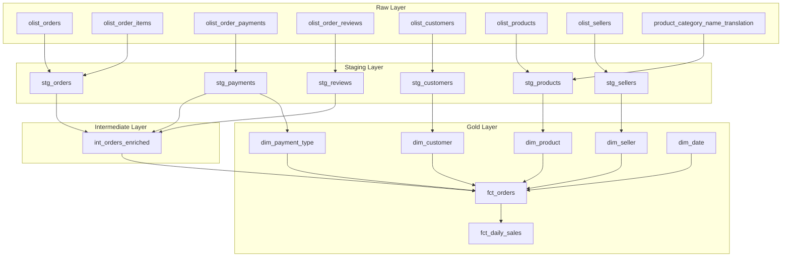
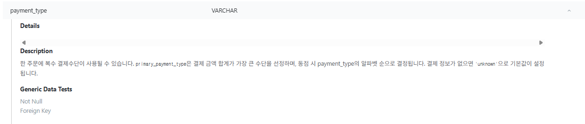
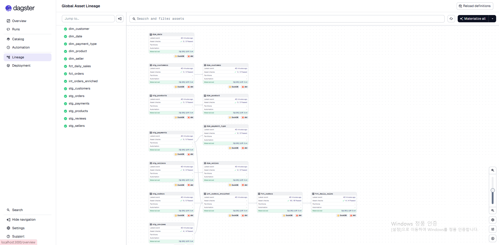
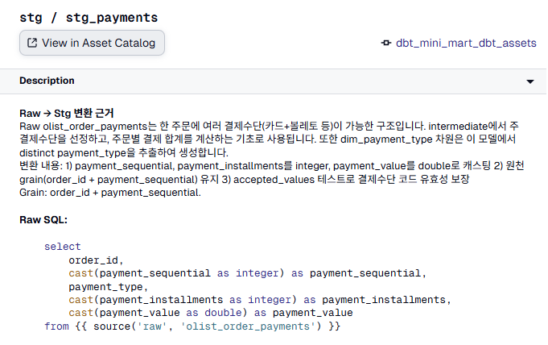

# dlt + dbt + DuckDB + Dagster로 로컬 스타스키마 데이터 마트 구축하기

> Olist e-커머스 공개 데이터셋을 활용하여 dlt 기반 데이터 적재 → 4계층 dbt 모델링 → 스타스키마 → Dagster 오케스트레이션 → Streamlit 대시보드까지 End-to-End 파이프라인을 구현한 과정을 정리합니다.

---

## 목차

1. [프로젝트 소개](#1-프로젝트-소개)
2. [기술 스택과 선택 이유](#2-기술-스택과-선택-이유)
3. [아키텍처 설계](#3-아키텍처-설계)
4. [구현 과정](#4-구현-과정)
   - [환경 설정](#4-1-환경-설정)
   - [Raw Layer — 원천 데이터 적재](#4-2-raw-layer--원천-데이터-적재)
   - [Staging Layer — 타입 캐스팅과 정제](#4-3-staging-layer--타입-캐스팅과-정제)
   - [Intermediate Layer — 비즈니스 로직 결합](#4-4-intermediate-layer--비즈니스-로직-결합)
   - [Gold Layer — 스타스키마](#4-5-gold-layer--스타스키마)
   - [테스트와 문서화](#4-6-테스트와-문서화)
   - [Dagster 오케스트레이션](#4-7-dagster-오케스트레이션)
   - [dlt — 선언적 데이터 적재](#4-8-dlt--선언적-데이터-적재)
   - [Streamlit 대시보드](#4-9-streamlit-대시보드)
5. [회고 및 배운 점](#5-회고-및-배운-점)

---

## 1. 프로젝트 소개

**dbt_mini_mart**는 Kaggle의 [Brazilian E-Commerce Public Dataset by Olist](https://www.kaggle.com/datasets/olistbr/brazilian-ecommerce) 데이터를 활용한 학습용 데이터 마트 프로젝트입니다.

- 8개 원천 CSV 테이블 → **14개 dbt 모델** → 최종 **스타스키마(Star Schema)** 데이터 마트
- 5개 차원 테이블(dim) + 2개 팩트 테이블(fct)
- 71개 데이터 품질 테스트 + Dagster 기반 파이프라인 오케스트레이션

### 원천 데이터 구조

Olist 데이터셋은 브라질 e-커머스 주문 데이터로, 아래 8개 테이블로 구성됩니다:

| 테이블 | 설명 | Grain |
|--------|------|-------|
| `olist_orders` | 주문 헤더 (상태, 일시) | order_id |
| `olist_order_items` | 주문 아이템 (가격, 배송비) | order_id + order_item_id |
| `olist_order_payments` | 결제 내역 (수단, 금액) | order_id + payment_sequential |
| `olist_order_reviews` | 리뷰 (평점) | review_id |
| `olist_customers` | 고객 마스터 | customer_id |
| `olist_products` | 상품 속성 (카테고리, 무게) | product_id |
| `olist_sellers` | 판매자 마스터 | seller_id |
| `product_category_name_translation` | 카테고리명 번역 (포르투갈어→영문) | product_category_name |

---

## 2. 기술 스택과 선택 이유

### 전체 스택

| 도구 | 역할 | 버전 |
|------|------|------|
| **dbt-core** | SQL 모델링, 테스트, 문서화 | 1.8+ |
| **DuckDB** | 로컬 OLAP 웨어하우스 | 1.0+ |
| **Dagster** | 파이프라인 오케스트레이션 | 1.12+ |
| **uv** | Python 의존성 관리 | - |
| **dlt** | 선언적 데이터 적재 (EL) | 1.24+ |
| **Streamlit** | 대시보드 시각화 | 1.55+ |
| **Plotly** | 인터랙티브 차트 | 6.6+ |
| **dbt_utils** | 유틸리티 매크로/테스트 패키지 | 1.1+ |

 이번 프로젝트에서는 EL(dlt) + T(dbt) + Orchestration(Dagster) + Visualization(Streamlit)으로 이어지는 Modern Data Stack을 로컬 환경에서 구현하는 데 초점을 맞추었습니다.

DBT duckdb 연결 설정
```yaml
# profiles.yml
mini_mart:
  target: dev
  outputs:
    dev:
      type: duckdb
      path: mini_mart.duckdb
      threads: 4
```

### DBT SEED 사용하지 않은 이유

dbt seed는 소규모 참조 데이터에는 적합하지만, 수만~수십만 행의 원천 데이터를 매번 seed로 올리기엔 비효율적입니다.

-  현업에서는 소규모의 dim 테이블을 제외하고는 dbt seed를 사용할일이 없음.

이 프로젝트에서는 **Python 스크립트로 CSV를 DuckDB에 벌크 로드**하고, dbt에서는 `source()`로 참조하는 방식을 채택했습니다:

```python
# scripts/load_raw_to_duckdb.py (핵심 부분)
con.execute("""
    create or replace table raw.{table} as
    select *, current_timestamp as _loaded_at
    from read_csv_auto(?, header=true)
""", [str(csv_path)])
```

**`_loaded_at` 컬럼을 자동 추가**해서 dbt의 source freshness 기능과 연동합니다.

### 왜 Dagster인가?

Airflow 대비 Dagster를 선택한 이유는 다음과 같습니다:

- **Asset 중심 패러다임**: dbt 모델이 곧 Dagster Asset으로 자동 매핑
- **dagster-dbt 통합**: manifest 기반으로 DAG를 자동 생성 — 별도 오퍼레이터 작성 불필요
- **Asset Catalog에 dbt 메타데이터 노출**: schema.yml에 작성한 모델 설명, 컬럼 정보, SQL, 테스트 현황이 Dagster UI에서 바로 확인 가능. Airflow에서는 dbt가 단순 태스크로 실행되므로, 이런 메타데이터를 오케스트레이터에서 조회할 수 없음
- **로컬 개발 친화**: `dagster dev` 한 줄로 웹 UI + 실행 환경 기동

---

## 3. 아키텍처 설계

### 4계층 모델링 (Layered Architecture)



**각 계층의 역할:**

| 계층 | Materialization | 역할 |
|------|----------------|------|
| **Raw** | 테이블 (dlt 적재) | dlt 파이프라인으로 CSV → DuckDB 벌크 로드. `_loaded_at` 자동 추가 |
| **Staging** | 뷰 (view) | 타입 캐스팅, 컬럼 리네이밍, 단순 조인 |
| **Intermediate** | 뷰 (view) | 여러 staging 모델 결합, 비즈니스 로직 적용 |
| **Gold** | 테이블 (table) | 최종 분석용 스타스키마 (dim + fct) |

### 스타스키마 설계

```
              dim_date
                 │
dim_customer ────┤
                 │
dim_product  ────┼──── fct_orders ──── fct_daily_sales
                 │                         (집계)
dim_seller   ────┤
                 │
dim_payment_type─┘
```

**fct_orders** (Grain: 주문 아이템)
- 1행 = 주문 1개 아이템
- 5개 차원 FK: customer_id, product_id, seller_id, payment_type, date_key
- 측정값: item_price, freight_value, gross_item_amount, payment_total_value, avg_review_score

**fct_daily_sales** (Grain: 일별 + 판매자)
- fct_orders에서 집계
- 측정값: order_count, line_count, item_sales, freight_sales, gross_sales

### Grain 설계 결정

이 프로젝트에서 가장 중요한 설계 결정은 **분석 Grain을 "주문 아이템"으로 설정**한 것입니다.

Olist 데이터에서 하나의 주문(order_id)은 여러 아이템을 포함할 수 있습니다. 주문 헤더(orders) 기준이 아닌 **주문 아이템(order_items)** 기준으로 Grain을 잡아야 상품별, 판매자별 분석이 가능해집니다.

이를 위해 PK를 `order_line_id = order_id || '-' || order_item_id`로 설계하고, 이 로직을 매크로로 분리했습니다:

```sql
-- macros/generate_order_line_id.sql

    concat({{ order_id_col }}, '-', cast({{ item_id_col }} as varchar))

```

---

## 4. 구현 과정

### 4-1. 환경 설정

#### Python 환경 (uv)

```bash
# uv로 프로젝트 초기화
uv init dbt_mini_mart
cd dbt_mini_mart

# 의존성 추가
uv add dbt-duckdb "duckdb>=1.0,<2.0"
uv add dagster dagster-dbt dagster-webserver
```

#### dbt 프로젝트 설정

```yaml
# dbt_project.yml
name: mini_mart
version: 1.0.0
config-version: 2
profile: mini_mart

models:
  mini_mart:
    staging:
      +materialized: view       # 변환 비용 최소화
      +schema: stg
    intermediate:
      +materialized: view       # 중간 결과물은 뷰로 유지
      +schema: int
    gold:
      +materialized: table      # 최종 분석용은 테이블로 물리화
      +schema: gold
```

> **Materialization 전략**: Staging/Intermediate는 단순 변환이므로 뷰(view)로 비용을 줄이고, Gold는 분석 쿼리 성능을 위해 테이블(table)로 물리화했습니다.

#### 패키지 설치

```yaml
# packages.yml
packages:
  - package: dbt-labs/dbt_utils
    version: [">=1.1.0", "<2.0.0"]
```

```bash
dbt deps
```

`dbt_utils`에서 활용한 기능:
- `date_spine()`: dim_date 생성
- `unique_combination_of_columns`: 복합 PK 유일성 테스트
- `accepted_range`: 값 범위 검증

---

### 4-2. Raw Layer — 원천 데이터 적재

dbt seed는 작은 참조 테이블용이므로, 원천 데이터는 **Python 스크립트로 DuckDB에 직접 벌크 로드**합니다.

```python
# scripts/load_raw_to_duckdb.py
con = duckdb.connect(str(DB_PATH))
con.execute("create schema if not exists raw")

for table in RAW_TABLES:
    csv_path = resolve_csv_path(table, source_dir)
    con.execute("""
        create or replace table raw.{table} as
        select *, current_timestamp as _loaded_at
        from read_csv_auto(?, header=true)
    """, [str(csv_path)])
```

**설계 포인트:**

1. **`_loaded_at` 자동 추가** — dbt source freshness와 연동
2. **파일명 후보 매핑** — Kaggle 원본(`*_dataset.csv`)과 가공 파일(`*.csv`) 모두 지원
3. **소스 디렉토리 우선순위** — CLI 인자 → 환경변수(`MINI_MART_SOURCE_DIR`) → `data/common` → `data/raw`

dbt에서는 `source()` 함수로 raw 계층을 참조합니다:

```yaml
# models/raw/raw_sources.yml
sources:
  - name: raw
    schema: raw
    loaded_at_field: _loaded_at
    freshness:
      warn_after: { count: 24, period: hour }
      error_after: { count: 72, period: hour }
    tables:
      - name: olist_orders
        columns:
          - name: order_id
            tests: [unique, not_null]
      # ... 8개 테이블 전체 정의
```

실행:

```bash
# CSV → DuckDB 적재
python scripts/load_raw_to_duckdb.py

# freshness 확인
dbt source freshness
```

---

### 4-3. Staging Layer — 타입 캐스팅과 정제

Staging의 원칙: **원천 데이터의 "형태"만 정리하고, 비즈니스 로직은 넣지 않는다.**

#### stg_orders — Grain 변경이 핵심

```sql
-- models/staging/stg_orders.sql
with orders as (
    select * from {{ source('raw', 'olist_orders') }}
),
lines as (
    select * from {{ source('raw', 'olist_order_items') }}
)
select
    {{ generate_order_line_id('l.order_id', 'l.order_item_id') }}
        as order_line_id,
    o.order_id,
    o.customer_id,
    l.seller_id,
    cast(o.order_purchase_timestamp as timestamp) as order_purchase_ts,
    cast(o.order_purchase_timestamp as date)      as order_date,
    o.order_status,
    l.product_id,
    cast(l.order_item_id as integer) as order_item_id,
    cast(l.price as double)          as item_price,
    cast(l.freight_value as double)  as freight_value,
    cast(l.price as double) + cast(l.freight_value as double) as gross_item_amount
from lines l
join orders o on l.order_id = o.order_id
```

여기서 가장 중요한 결정:
- `olist_orders`(주문 헤더)와 `olist_order_items`(주문 아이템)를 **inner join**
- Grain이 `order_id` → `order_line_id`(주문 아이템)로 변경
- 파생 컬럼 `gross_item_amount = item_price + freight_value`

#### stg_products — 번역 테이블 조인

```sql
-- models/staging/stg_products.sql
select
    p.product_id,
    p.product_category_name,
    t.product_category_name_english,   -- 포르투갈어 → 영문 변환
    cast(p.product_weight_g as integer) as product_weight_g,
    -- ...
from {{ source('raw', 'olist_products') }} p
left join {{ source('raw', 'product_category_name_translation') }} t
    on p.product_category_name = t.product_category_name
```

**LEFT JOIN을 사용한 이유**: 번역이 없는 카테고리가 있어도 상품을 누락시키지 않기 위해서입니다.

#### 나머지 Staging 모델

| 모델 | 핵심 변환 |
|------|----------|
| `stg_customers` | zip_code를 varchar로 캐스팅 (앞자리 0 보존) |
| `stg_payments` | payment_value → double, payment_sequential → integer |
| `stg_reviews` | review_score → integer, 텍스트 코멘트 제외 |
| `stg_sellers` | zip_code를 varchar로 캐스팅 |

---

### 4-4. Intermediate Layer — 비즈니스 로직 결합

`int_orders_enriched`는 staging의 여러 모델을 결합하여 분석에 필요한 파생 컬럼을 만듭니다.

```sql
-- models/intermediate/int_orders_enriched.sql (핵심 로직)

-- 1. 주문별 결제 총액
payment_by_order as (
    select order_id, sum(payment_value) as payment_total_value
    from {{ ref('stg_payments') }}
    group by 1
),

-- 2. 주결제수단 선정 (금액 기준 최상위)
payment_type_ranked as (
    select
        order_id, payment_type,
        row_number() over (
            partition by order_id
            order by sum(payment_value) desc, payment_type
        ) as rn
    from {{ ref('stg_payments') }}
    group by 1, 2
),

-- 3. 주문별 평균 리뷰 점수
review_by_order as (
    select order_id, avg(cast(review_score as double)) as avg_review_score
    from {{ ref('stg_reviews') }}
    group by 1
),

-- 4. 주문별 아이템 수
item_count as (
    select order_id, count(*) as order_item_count
    from base
    group by 1
)
```

**파생 컬럼 요약:**

| 컬럼 | 로직 | 기본값 |
|------|------|--------|
| `payment_total_value` | 주문 전체 결제 합계 | 0 |
| `primary_payment_type` | 금액 기준 최상위 결제수단 | 'unknown' |
| `avg_review_score` | 주문 평균 리뷰 점수 | NULL |
| `order_item_count` | 해당 주문의 아이템 수 | — |

> **설계 의도**: `primary_payment_type`은 한 주문에 여러 결제수단이 사용될 수 있으므로, "가장 큰 금액을 차지하는 수단"을 대표값으로 선정합니다. 동점 시에는 payment_type 알파벳순으로 결정합니다.

---

### 4-5. Gold Layer — 스타스키마

Gold 계층에서 최종 스타스키마를 구성합니다. Materialization은 **table**로 설정하여 분석 쿼리 성능을 확보합니다.

#### 차원 테이블 (Dimension)

| 차원 | 소스 | Grain | 특이사항 |
|------|------|-------|---------|
| `dim_customer` | stg_customers | customer_id | pass-through |
| `dim_product` | stg_products | product_id | 영문 카테고리 포함 |
| `dim_seller` | stg_sellers | seller_id | pass-through |
| `dim_payment_type` | stg_payments | payment_type | DISTINCT 추출 + label 생성 |
| `dim_date` | dbt_utils.date_spine | date_key | 2016-01-01 ~ 2019-01-01 |

**dim_date** 생성에는 `dbt_utils.date_spine()`과 프로젝트 전역 매크로를 활용합니다:

```sql
-- macros/date_range.sql

    cast('2016-01-01' as date)



    cast('2019-01-01' as date)

```

```sql
-- models/gold/dim_date.sql
with spine as (
    {{ dbt_utils.date_spine(
        datepart='day',
        start_date=date_range_start(),
        end_date=date_range_end()
    ) }}
)
select
    cast(date_day as date) as date_key,
    extract(year from date_day) as year_num,
    extract(month from date_day) as month_num,
    extract(day from date_day) as day_num,
    strftime(date_day, '%Y-%m') as year_month,
    case when extract(dow from date_day) in (0, 6) then true else false end as is_weekend
from spine
```

> **날짜 범위를 매크로로 중앙 관리**하면, dim_date와 데이터 검증 테스트에서 동일한 범위를 참조할 수 있어 불일치를 방지합니다.

#### 팩트 테이블 (Fact)

**fct_orders** — 주문 아이템 단위

```sql
-- models/gold/fct_orders.sql
select
    o.order_line_id,
    o.order_date          as date_key,       -- → dim_date
    o.customer_id,                            -- → dim_customer
    o.product_id,                             -- → dim_product
    o.seller_id,                              -- → dim_seller
    o.primary_payment_type as payment_type,   -- → dim_payment_type
    o.order_status,
    o.order_item_id,
    o.order_item_count,
    o.item_price,
    o.freight_value,
    o.gross_item_amount,
    o.payment_total_value,
    o.avg_review_score
from {{ ref('int_orders_enriched') }} o
```

**fct_daily_sales** — 일별 판매자 집계

```sql
-- models/gold/fct_daily_sales.sql
select
    date_key,
    seller_id,
    count(distinct order_id) as order_count,
    count(*)                 as line_count,
    sum(item_price)          as item_sales,
    sum(freight_value)       as freight_sales,
    sum(gross_item_amount)   as gross_sales
from {{ ref('fct_orders') }}
group by 1, 2
```

---

### 4-6. 테스트와 문서화

#### 테스트 전략 (71개 테스트)

이 프로젝트는 **3종류의 테스트**를 활용합니다:

**1) Generic Tests (스키마 테스트)** — 63개

각 모델의 `_schema.yml`에서 선언적으로 정의:

```yaml
# models/gold/gold_schema.yml (예시)
models:
  - name: fct_orders
    columns:
      - name: order_line_id
        tests: [unique, not_null]
      - name: customer_id
        tests:
          - relationships:
              to: ref('dim_customer')
              field: customer_id
      - name: item_price
        tests:
          - dbt_utils.accepted_range:
              min_value: 0
```

테스트 유형별 분류:

| 유형 | 수 | 예시 |
|------|---|------|
| unique / not_null | 20+ | PK 무결성 |
| relationships | 5 | FK 참조 무결성 (fct_orders → 5개 dim) |
| accepted_values | 2 | payment_type 허용값 |
| accepted_range | 6 | 금액 >= 0, 리뷰 1~5점 |
| unique_combination_of_columns | 1 | fct_daily_sales 복합 PK |

**2) Source Freshness** — 8개

```yaml
freshness:
  warn_after: { count: 24, period: hour }
  error_after: { count: 72, period: hour }
```

모든 raw 테이블에 적용. `_loaded_at` 컬럼 기준으로 데이터 신선도를 모니터링합니다.

**3) Singular Tests (커스텀 검증)** — 3개

```sql
-- tests/assert_daily_sales_reconciles.sql
-- fct_daily_sales 합계와 fct_orders 합계의 정합성 검증
with daily as (
    select sum(gross_sales) as total from {{ ref('fct_daily_sales') }}
),
orders as (
    select sum(gross_item_amount) as total from {{ ref('fct_orders') }}
)
select *
from daily cross join orders
where abs(daily.total - orders.total) > 0.01   -- 소수점 오차 허용
```

| 테스트 | 검증 내용 |
|--------|----------|
| `assert_daily_line_count_matches` | fct_daily_sales의 line_count 합 = fct_orders 총 행 수 |
| `assert_daily_sales_reconciles` | fct_daily_sales의 gross_sales 합 = fct_orders의 gross_item_amount 합 |
| `assert_orders_within_date_range` | 모든 주문 날짜가 dim_date 범위(2016~2019) 내 |

#### 문서화

dbt docs block으로 비즈니스 컨텍스트를 코드 옆에 유지합니다:

```markdown
<!-- models/docs.md -->

이 모델의 Grain은 **주문 아이템(order line)**입니다.
한 주문(order_id)에 여러 아이템이 포함될 수 있으며,
`order_line_id = order_id || '-' || order_item_id`가 PK입니다.



한 주문에 복수 결제수단이 사용될 수 있습니다.
`primary_payment_type`은 결제 금액 합계가 가장 큰 수단을 선정하며,
동점 시 payment_type의 알파벳 순으로 결정됩니다.

```



```bash
dbt docs generate && dbt docs serve
```

---

### 4-7. Dagster 오케스트레이션

dbt 모델을 Dagster Asset으로 자동 매핑하여, 웹 UI에서 DAG를 시각화하고 실행할 수 있습니다.



#### 프로젝트 설정

```python
# dagster_mini_mart/project.py
from dagster_dbt import DbtProject

dbt_project = DbtProject(
    project_dir=DAGSTER_DBT_PROJECT_DIR,
    target_path=DAGSTER_DBT_PROJECT_DIR / "target",
)
dbt_project.prepare_if_dev()
```

#### Asset 정의

```python
# dagster_mini_mart/assets.py
from dagster import AssetExecutionContext
from dagster_dbt import DbtCliResource, dbt_assets

@dbt_assets(manifest=dbt_project.manifest_path)
def dbt_mini_mart_dbt_assets(context: AssetExecutionContext, dbt: DbtCliResource):
    yield from dbt.cli(["build"], context=context).stream()
```

`@dbt_assets` 데코레이터가 dbt manifest를 읽어서, **14개 dbt 모델 + 8개 source = 22개 Dagster Asset**을 자동 생성합니다. `dbt build`는 모델 빌드와 테스트를 DAG 순서대로 실행합니다.

#### Asset Catalog — dbt 메타데이터가 Dagster UI에 노출되는 구조

`@dbt_assets(manifest=...)`가 manifest를 파싱할 때, dbt schema.yml에 작성한 description·컬럼 정보·테스트 목록·Raw SQL까지 함께 읽어서 Dagster Asset의 메타데이터로 등록합니다.

이 덕분에 Dagster UI의 Asset Catalog에서:

- 모델별 **Description** (docs block 포함)
- **Raw SQL** 원문
- 컬럼별 설명과 **Generic Data Tests** 적용 현황

을 코드 저장소를 열지 않고도 바로 확인할 수 있습니다.



Airflow에서는 dbt가 `BashOperator`나 Cosmos를 통해 "태스크"로 실행될 뿐이고, 모델 단위의 설명·SQL·테스트 메타데이터가 Airflow UI에 노출되지 않습니다. 이 차이가 dbt 프로젝트에서 Dagster를 선택하게 된 가장 실용적인 이유 중 하나였습니다.

#### Definitions

```python
# dagster_mini_mart/definitions.py
defs = Definitions(
    assets=[dlt_raw_ingest, dbt_mini_mart_dbt_assets],
    jobs=[dbt_build_job, dbt_source_freshness_job, dbt_test_modified_job],
    sensors=[routed_failure_sensor],
    resources={
        "dbt": DbtCliResource(project_dir=dbt_project),
    },
)
```

dlt 적재 asset(`dlt_raw_ingest`)과 dbt 모델 asset이 하나의 Definitions에 등록되어, Dagster UI에서 **ingestion → transform → gold** 전체 리니지를 한눈에 확인할 수 있습니다.

#### 실행

```bash
dagster dev
# → http://localhost:3000 에서 Asset DAG 확인 및 실행
```

---

### 4-8. dlt — 선언적 데이터 적재

기존 `load_raw_to_duckdb.py`는 순수 Python + DuckDB SQL로 CSV를 적재하는 방식이었습니다. 이를 **dlt(data load tool)**로 교체하여 선언적 EL(Extract-Load) 파이프라인을 구축했습니다.

#### 왜 dlt인가?

| 관점 | Python 스크립트 | dlt |
|------|----------------|-----|
| 스키마 관리 | 수동 (`CREATE TABLE`) | 자동 추론 + 진화 |
| 메타데이터 | 없음 | `_dlt_load_id`, `_dlt_id` 자동 추가 |
| 로드 전략 | 직접 구현 | `write_disposition` 선언 (`replace`, `append`, `merge`) |
| Dagster 통합 | op/job으로 감싸야 함 | multi-asset으로 자연스럽게 매핑 |
| 확장성 | 새 소스 추가 시 SQL 작성 | `@dlt.resource` 추가만으로 확장 |

#### dlt 파이프라인 구현

```python
# scripts/load_raw_dlt.py (핵심 부분)

@dlt.source(name="olist_raw")
def olist_raw_source(source_dir: Path):
    loaded_at = datetime.now(timezone.utc).isoformat()

    for table in RAW_TABLES:
        csv_path = _resolve_csv_path(table, source_dir)

        @dlt.resource(name=table, write_disposition="replace", primary_key=None)
        def _load_table(path: Path = csv_path, ts: str = loaded_at):
            rows = _read_csv_rows(path)
            for row in rows:
                row["_loaded_at"] = ts    # dbt source freshness 연동
                yield row

        yield _load_table

pipeline = dlt.pipeline(
    pipeline_name="olist_raw_load",
    destination=dlt.destinations.duckdb(str(DB_PATH)),
    dataset_name="raw",
)
load_info = pipeline.run(olist_raw_source(source_dir=source_dir))
```

**설계 포인트:**

1. **`@dlt.source` + `@dlt.resource`**: 8개 CSV 테이블을 선언적으로 정의. 새 테이블 추가 시 `RAW_TABLES` 리스트에 한 줄만 추가하면 됨
2. **`write_disposition="replace"`**: 매번 전체 교체. 원천 데이터 변경이 적은 배치 파이프라인에 적합
3. **`_loaded_at` 수동 추가**: dbt source freshness와의 호환성을 위해 UTC 타임스탬프를 명시적으로 삽입
4. **dlt 자동 메타데이터**: `_dlt_load_id`(로드 배치 추적), `_dlt_id`(행 고유 ID)가 자동 생성되어 데이터 리니지 추적에 활용 가능

#### Dagster multi-asset으로 통합

dlt 파이프라인을 Dagster `@multi_asset`으로 래핑하여, 8개 raw 테이블이 Dagster UI에서 개별 asset으로 나타나도록 구현했습니다.

```python
# dagster_mini_mart/dlt_assets.py (핵심 부분)

_outs = {
    table: AssetOut(key=["raw", table], group_name="ingestion", is_required=False)
    for table in RAW_TABLES
}

@multi_asset(name="dlt_raw_ingest", outs=_outs, compute_kind="dlt", can_subset=True)
def dlt_raw_ingest(context):
    _drop_raw_tables()                          # 기존 테이블 정리
    pipeline = dlt.pipeline(...)
    load_info = pipeline.run(_olist_raw_source())

    selected = context.selected_output_names    # subset 실행 지원
    for table in RAW_TABLES:
        if table not in selected:
            continue
        count = _row_count(table)
        yield MaterializeResult(
            asset_key=["raw", table],
            metadata={"row_count": MetadataValue.int(count)},
        )
```

이 통합으로 Dagster UI에서 다음과 같은 End-to-End 리니지가 가능합니다:

```
[dlt] raw/olist_orders     →  [dbt] stg_orders     →  int_orders_enriched  →  fct_orders
[dlt] raw/olist_customers  →  [dbt] stg_customers   →                         dim_customer
[dlt] raw/olist_products   →  [dbt] stg_products    →                         dim_product
...                                                                            fct_daily_sales
```

#### 트러블슈팅

dlt + Dagster 통합 과정에서 발생한 주요 이슈들을 기록해 두었습니다 (`docs/dlt_dagster_troubleshooting.md`):

| 이슈 | 원인 | 해결 |
|------|------|------|
| DuckDB NOT NULL 컬럼 추가 불가 | dlt 메타데이터 컬럼(`_dlt_id` 등)을 기존 테이블에 ALTER 시도 | 파이프라인 실행 전 기존 테이블 DROP |
| `dev_mode=True` 스키마명 변경 | dataset에 타임스탬프 suffix 추가됨 | `dev_mode` 제거로 스키마명 고정 |
| Dagster context type hint 거부 | Dagster 1.12에서 multi_asset의 type annotation 호환성 | annotation 제거 |
| subset materialize 시 asset key 미스매치 | 선택되지 않은 asset에도 MaterializeResult yield | `context.selected_output_names` 필터 추가 |

---

### 4-9. Streamlit 대시보드

dbt gold 레이어의 데이터를 **Streamlit + Plotly**로 시각화하여, 분석 결과를 대시보드로 제공합니다.

#### 아키텍처

```
DuckDB (main_gold schema)
    │
    ├── fct_orders          ─┐
    ├── fct_daily_sales      │
    ├── dim_customer         ├──→  Streamlit App  ──→  http://localhost:8501
    ├── dim_product          │
    ├── dim_payment_type    ─┘
    └── dim_seller
```

Streamlit은 DuckDB에 **read-only로 직접 연결**합니다. 별도의 중간 데이터 저장소나 API 서버 없이 gold 테이블을 바로 쿼리합니다.

#### 대시보드 구성

**KPI 카드** (상단):

| 지표 | 소스 |
|------|------|
| 주문 수 | `count(DISTINCT order_id)` from fct_orders |
| 주문 아이템 수 | `count(*)` from fct_orders |
| 총 매출 | `sum(gross_item_amount)` from fct_orders |
| 평균 리뷰 점수 | `avg(avg_review_score)` from fct_orders |

**차트 4개** (DE Zoomcamp 기준 2개 이상 필요):

| # | 차트 | 타입 | 데이터 소스 |
|---|------|------|-------------|
| 1 | 📈 일별 매출 추이 | Area (temporal) | `fct_daily_sales` — date_key별 gross_sales 합계 |
| 2 | 💳 결제수단별 주문 비율 | Donut (categorical) | `fct_orders` × `dim_payment_type` |
| 3 | 🏷️ 카테고리별 매출 TOP 10 | Bar (horizontal) | `fct_orders` × `dim_product` |
| 4 | 🗺️ 고객 주(州)별 분포 | Bar (colored) | `fct_orders` × `dim_customer` |

#### 핵심 구현

```python
# streamlit_app.py (핵심 부분)

@st.cache_resource
def get_connection():
    return duckdb.connect(str(DB_PATH), read_only=True)

def query(sql: str):
    return get_connection().execute(sql).fetchdf()

# 일별 매출 추이
daily = query("""
    SELECT date_key, sum(gross_sales) AS gross_sales, sum(order_count) AS order_count
    FROM main_gold.fct_daily_sales
    GROUP BY date_key ORDER BY date_key
""")
fig = px.area(daily, x="date_key", y="gross_sales")

# 결제수단 분포
payment = query("""
    SELECT p.payment_type_label, count(*) AS cnt
    FROM main_gold.fct_orders f
    JOIN main_gold.dim_payment_type p ON f.payment_type = p.payment_type
    GROUP BY 1 ORDER BY 2 DESC
""")
fig = px.pie(payment, names="payment_type_label", values="cnt", hole=0.4)
```

**설계 포인트:**

1. **`@st.cache_resource`로 DB 커넥션 캐싱** — 페이지 리렌더링마다 새 연결을 맺지 않음
2. **gold 테이블 직접 쿼리** — dbt가 이미 정제·집계한 데이터를 가져오므로, 대시보드 코드에 비즈니스 로직이 없음
3. **Plotly 인터랙티브 차트** — 줌, 필터, 호버 기능이 기본 제공

#### 실행

```bash
uv run streamlit run streamlit_app.py
# → http://localhost:8501 에서 대시보드 확인
```

---

## 5. 회고 및 배운 점

### 잘 된 점

- **Grain을 먼저 정의하니 모든 설계가 따라왔다.** order_line_id를 PK로 잡은 결정이 이후 모든 조인과 집계의 기준이 됐습니다.
- **매크로로 로직을 중앙 관리하니 일관성이 유지됐다.** `date_range_start/end`를 dim_date와 테스트에서 동시에 참조하니, 범위 불일치 버그가 원천 차단됩니다.
- **DuckDB로 빠르게 반복 개발할 수 있었다.** 클라우드 비용 없이 수만 행의 데이터를 로컬에서 즉시 테스트할 수 있었습니다.
- **dlt로 적재 코드를 선언적으로 전환했다.** 수동 SQL DDL 대신 `@dlt.resource`로 8개 테이블을 정의하니, 새 소스 추가가 한 줄로 끝납니다. `_dlt_load_id` 등 자동 메타데이터 덕분에 데이터 리니지 추적도 수월해졌습니다.
- **Streamlit으로 gold 레이어를 즉시 시각화할 수 있었다.** DuckDB read-only 연결으로 gold 테이블을 직접 쿼리하니, 별도 API 없이도 대시보드를 빠르게 구축할 수 있었습니다.

### 어려웠던 점

- **결제 데이터의 1:N 관계 처리**: 한 주문에 여러 결제수단이 사용될 수 있어, `primary_payment_type`을 선정하는 로직이 필요했습니다.
- **Staging에서 비즈니스 로직의 경계 설정**: "언제까지가 정제이고 언제부터 비즈니스 로직인가"의 판단이 중요했습니다. 이 프로젝트에서는 "두 테이블 이상의 정보를 결합하는 순간"을 Intermediate로 분리하는 기준을 적용했습니다.
- **dlt + Dagster 통합 시 호환성 이슈**: Dagster 1.12에서 `@multi_asset`의 context type hint 거부, DuckDB의 NOT NULL 컬럼 ADD 제약, subset materialize 시 asset key 미스매치 등 다양한 이슈가 발생했습니다. 트러블슈팅 과정을 별도 문서로 기록했습니다.

### 개선 가능한 부분

- Incremental 모델 적용 (대용량 시나리오)
- dbt Metrics / Semantic Layer 도입
- CI/CD에서 `dbt build` + `dagster asset materialize` 자동화
- Streamlit Cloud 배포 또는 Docker 컨테이너화
- dlt의 `merge` write_disposition 활용 (change data capture 시나리오)

---

## 프로젝트 링크

- **GitHub**: [kgeonhoe/dbt_mini_mart](https://github.com/kgeonhoe/dbt_mini_mart)
- **데이터 출처**: [Olist Brazilian E-Commerce Dataset (Kaggle)](https://www.kaggle.com/datasets/olistbr/brazilian-ecommerce)
