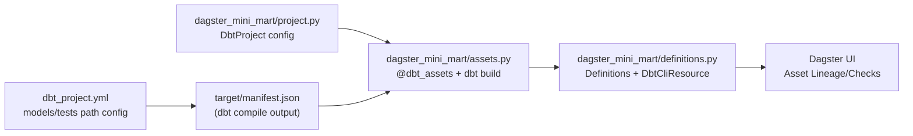

# Dagster + dbt: Connection Architecture and Operations Guide

This document explains **how Dagster and dbt are connected and operate** in this repository at the code level,
along with **test operations** and **data lineage/documentation management** practices.

---

## 1. Dagster-dbt Connection Architecture



Core files:

1. `dagster_mini_mart/project.py`
- Pins the dbt project and target paths with `DbtProject(project_dir=..., target_path=...)`.
- `prepare_if_dev()` assists manifest preparation in development mode.

2. `dagster_mini_mart/assets.py`
- `@dbt_assets(manifest=dbt_project.manifest_path)` reads the manifest and maps dbt nodes to Dagster assets.
- The current execution command is `dbt build`.

```python
@dbt_assets(manifest=dbt_project.manifest_path)
def dbt_mini_mart_dbt_assets(context: AssetExecutionContext, dbt: DbtCliResource):
    yield from dbt.cli(["build"], context=context).stream()
```

3. `dagster_mini_mart/definitions.py`
- The Dagster entry point that bundles assets and resources together.
- Injects `DbtCliResource(project_dir=dbt_project)` to provide the dbt CLI execution context.

---

## 2. How dbt Tests Enter Dagster in This Architecture

### 2-1. Test Definition Locations

1. Generic tests
- `models/staging/stg_schema.yml`
- `models/gold/gold_schema.yml`

2. Singular tests
- `tests/*.sql`
- Registered via `test-paths: ["tests"]` in `dbt_project.yml`

3. Source freshness
- `models/raw/raw_sources.yml`
- Defined with `freshness` and `loaded_at_field: _loaded_at`

### 2-2. How Dagster Recognizes Tests

- When `dbt build` runs inside Dagster, model build and test events are streamed.
- dagster-dbt connects these events to the Dagster asset context, enabling test result tracking in the UI.

Key point:
- The current code runs `dbt build`.
- `dbt source freshness` requires a separate execution to complete periodic freshness monitoring.

Below is the actual dbt asset definition code:

```python
# dagster_mini_mart/assets.py
from dagster import AssetExecutionContext
from dagster_dbt import DbtCliResource, dbt_assets

from .project import dbt_project


@dbt_assets(manifest=dbt_project.manifest_path)
def dbt_mini_mart_dbt_assets(context: AssetExecutionContext, dbt: DbtCliResource):
  yield from dbt.cli(["build"], context=context).stream()
```

The Asset runs `dbt build`, while `dbt source freshness` is executed separately via a dedicated Job in `jobs.py`.

---

## 3. Operating Tests in Dagster

This project separates test execution paths by operational purpose rather than bundling everything into a single long pipeline.

The default batch runs `dbt build` to verify model builds and tests together.
Source data health checks use `dbt source freshness` in a separate Job on a shorter cycle.
When change impact verification is needed, `dbt test --select state:modified+` quickly validates only modified models and their downstream.

The following Jobs implement this strategy in the current repository:

- `dbt_build_job`: Integrated model build + test execution
- `dbt_source_freshness_job`: Dedicated source freshness check
- `dbt_test_modified_job`: Selective testing focused on changed models

Separating execution paths makes failure signals operationally distinguishable — whether it's a transformation logic error, a data quality rule violation, or a source data delay can be quickly identified in the Dagster UI and alerts.

### Asset Sample Code

Below is the dbt Asset execution example used in this repository. Calling `dbt build` within the Asset execution context streams both model build and test events to the Dagster UI.

```python
from dagster import AssetExecutionContext
from dagster_dbt import DbtCliResource, dbt_assets

from .project import dbt_project


@dbt_assets(manifest=dbt_project.manifest_path)
def dbt_mini_mart_dbt_assets(context: AssetExecutionContext, dbt: DbtCliResource):
  yield from dbt.cli(["build"], context=context).stream()
```

When separating Jobs for operations within the same project, `jobs.py` calls `dbt source freshness` and `dbt test --select state:modified+` as individual Jobs.

### Operations Checklist

1. Clear test failure criteria
- PK/FK/accepted_range failures trigger immediate failure
- Reconciliation/singular tests have pre-defined warn or fail policies

2. Schedule separation
- `dbt build`: Runs during batch windows
- `source freshness`: Runs on a shorter cycle

3. Alert channel separation
- Data delays (freshness) and transformation errors (build/test) route to different alerts

### Failure Sensor Implementation (JSON Routing)

The repository has a failure sensor implemented in code, with alert routing rules managed in a JSON file.
Since channels are not yet finalized, the dispatch mode is `log`, recording failure events as structured logs.

Implementation files:

- `dagster_mini_mart/alert_routing.json`: Per-Job alert routing rules
- `dagster_mini_mart/alerts.py`: Failure sensor + routing loader
- `dagster_mini_mart/definitions.py`: Sensor registration

Current routing rules:

- `data_delay` → `dbt_source_freshness_job`
- `transform_error` → `dbt_build_job`, `dbt_test_modified_job`

Definition file: `dagster_mini_mart/alert_routing.json`

```json
{
  "mode": "log",
  "routes": {
    "data_delay": {
      "jobs": ["dbt_source_freshness_job"],
      "target": "TBD_DATA_DELAY_CHANNEL"
    },
    "transform_error": {
      "jobs": ["dbt_build_job", "dbt_test_modified_job"],
      "target": "TBD_TRANSFORM_ERROR_CHANNEL"
    }
  }
}
```

Failure detection is handled by a single sensor (`routed_failure_sensor`), which determines the route based on the failed Job name.

```python
@run_status_sensor(run_status=DagsterRunStatus.FAILURE)
def routed_failure_sensor(context) -> None:
    dagster_run = context.dagster_run
    route = _get_route_for_job(dagster_run.job_name)
    if route is None:
        return

    route_name, route_conf = route
    payload = _build_payload(
        job_name=dagster_run.job_name,
        run_id=dagster_run.run_id,
        status="FAILURE",
    )
    _dispatch_alert(route_name, route_conf, payload)
```

Once channels are finalized, only `_dispatch_alert` needs to be swapped for a Slack/Teams/Webhook implementation. Job routing rules continue to be managed in `alert_routing.json`.

---

## 4. Data Lineage and Docs Management

### 4-1. Lineage Source of Truth

- Dependency basis: dbt's `ref()`, `source()`
- Visualization tools:
  1. dbt docs lineage
  2. Dagster asset lineage

Establishing a team convention on which to use as the primary reference is important.

Recommended approach:
- Development/model review: dbt docs
- Operations/execution status tracking: Dagster UI

### 4-2. Rules for Maintainable Documentation

1. Document-beside-model principle
- Descriptions live in `*_schema.yml` + `models/docs.md`, version-controlled alongside code

2. Separate grain/core business rules into docs blocks
- e.g., `grain_order_line`, `primary_payment_type`

3. Co-modification principle
- When SQL changes, update description/tests/docs blocks in the same PR

4. Automated doc generation
- Run `dbt docs generate` in CI or as a scheduled job

### 4-3. Layer Design Decisions That Improved Lineage Quality

The lineage in this project stays relatively clean because each layer's role is strictly separated.

The Staging layer only performs source column renaming and type casting — no business logic.
This means Staging nodes appear as simple pass-through points in the lineage graph, allowing root cause analysis to quickly narrow to Intermediate and beyond when issues arise.

Joins and business rules are concentrated in Intermediate.
For example, `int_orders_enriched` joins orders-payments-reviews and creates derived columns.
This approach confines modification points to a single location when rules need to change.

The Gold layer maintains BI consumer-oriented naming.
Names like `dim_customer` and `fct_daily_sales` let analysts understand each model's role from the name alone when tracing lineage.

---

## 5. Remaining Improvements for This Repository

1. Add Job scheduling/automation
- Jobs are implemented; time-based schedules or sensor connections are needed

2. Test result classification dashboard
- Group PK/FK/Range/Singular failures by tag

3. Codify documentation rules
- Add "SQL + schema + docs co-modification" rule to README or CONTRIBUTING

4. Change-scoped test strategy
- PRs use `--select state:modified+` for fast feedback
- Pre-deploy to main runs full build/full test

---

## 6. Key Takeaways

- This project's Dagster-dbt connection consists of three elements: `DbtProject` + `@dbt_assets(manifest=...)` + `DbtCliResource`.
- Tests are defined in dbt; Dagster serves as the execution/observation layer.
- Operationally, separating `build` and `freshness` into distinct Jobs is the most effective approach.
- For lineage and docs, the most stable pattern is "dbt defines, Dagster surfaces in operations."
