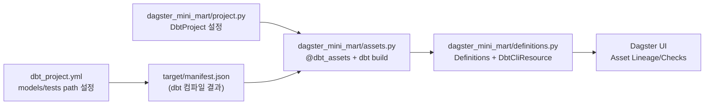
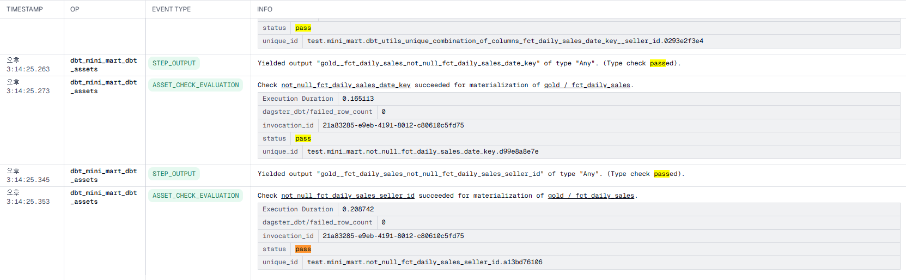

# Dagster + dbt 연결 구조와 운영 가이드

이 문서는 이 저장소에서 **Dagster와 dbt가 어떻게 연결되어 동작하는지**를 코드 기준으로 설명하고,
추가로 **테스트 운영 방식**과 **데이터 리니지/문서 관리 방식**을 정리한 기술 노트입니다.

---

## 1. dagster dbt 연결구조



핵심 파일

1. `dagster_mini_mart/project.py`
- `DbtProject(project_dir=..., target_path=...)`로 dbt 프로젝트 경로와 target 경로를 고정합니다.
- `prepare_if_dev()`로 개발 모드에서 manifest 준비를 보조합니다.

2. `dagster_mini_mart/assets.py`
- `@dbt_assets(manifest=dbt_project.manifest_path)`가 manifest를 읽어 dbt 노드를 Dagster asset으로 매핑합니다.
- 현재 실행 커맨드는 `dbt build`입니다.

```python
@dbt_assets(manifest=dbt_project.manifest_path)
def dbt_mini_mart_dbt_assets(context: AssetExecutionContext, dbt: DbtCliResource):
    yield from dbt.cli(["build"], context=context).stream()
```

3. `dagster_mini_mart/definitions.py`
- Dagster 로드 포인트로, assets와 resources를 하나로 묶습니다.
- `DbtCliResource(project_dir=dbt_project)`를 주입해 dbt CLI 실행 컨텍스트를 제공합니다.

---

## 2. 이 구조에서 dbt 테스트는 어떻게 Dagster로 들어오나?

### 2-1. 테스트 정의 위치

1. Generic tests
- `models/staging/stg_schema.yml`
- `models/gold/gold_schema.yml`

2. Singular tests
- `tests/*.sql`
- 경로는 `dbt_project.yml`의 `test-paths: ["tests"]`로 등록

3. Source freshness
- `models/raw/raw_sources.yml`
- `freshness`, `loaded_at_field: _loaded_at` 정의

### 2-2. Dagster 인식 방식

- `dbt build`를 Dagster에서 실행하면, 모델 빌드와 테스트 이벤트가 스트리밍됩니다.
- dagster-dbt가 이 이벤트를 Dagster asset 컨텍스트로 연결해, UI에서 테스트 결과를 추적할 수 있게 됩니다.


중요 포인트:
- 현재 코드가 실행하는 것은 `dbt build`이며,
- `dbt source freshness`는 별도 실행을 붙여야 주기적 freshness 운영이 완성됩니다.

아래는 실제 `dbt asset` 정의 코드입니다.

```python
# dagster_mini_mart/assets.py
from dagster import AssetExecutionContext
from dagster_dbt import DbtCliResource, dbt_assets

from .project import dbt_project


@dbt_assets(manifest=dbt_project.manifest_path)
def dbt_mini_mart_dbt_assets(context: AssetExecutionContext, dbt: DbtCliResource):
  yield from dbt.cli(["build"], context=context).stream()
```

위 코드처럼 Asset에서는 `dbt build`를 실행하고, `dbt source freshness`는 `jobs.py`의 별도 Job에서 분리 실행합니다.

---

## 3. 테스트를 Dagster에서 운영하는 방식

이 프로젝트는 테스트를 하나의 긴 파이프라인으로 묶기보다, 운영 목적에 따라 실행 경로를 분리하는 방식을 채택했습니다.

기본 배치에서는 `dbt build`를 실행해 모델 빌드와 테스트를 함께 검증하고,
소스 데이터 상태 점검은 `dbt source freshness`를 별도 Job으로 분리해 더 짧은 주기로 모니터링합니다.
변경 영향 검증이 필요한 경우에는 `dbt test --select state:modified+`를 사용해 수정된 모델 주변만 빠르게 확인합니다.

현재 저장소에는 이 전략이 아래 Job으로 구현되어 있습니다.

- `dbt_build_job`: 모델 빌드 + 테스트 통합 실행
- `dbt_source_freshness_job`: source freshness 전용 점검
- `dbt_test_modified_job`: 변경 모델 중심 선택 테스트

이렇게 실행 경로를 분리하면 실패 신호를 운영 관점에서 명확히 구분할 수 있습니다.
예를 들어 변환 로직 오류인지, 데이터 품질 규칙 위반인지, 혹은 원천 데이터 지연인지가 Dagster UI와 알림에서 빠르게 식별됩니다.

### Asset 샘플 코드

아래는 이 저장소에서 사용 중인 dbt Asset 실행 예시입니다. `dbt build`를 Asset 실행 컨텍스트에서 호출하면,
모델 빌드와 테스트 이벤트가 함께 Dagster UI로 스트리밍됩니다.

```python
from dagster import AssetExecutionContext
from dagster_dbt import DbtCliResource, dbt_assets

from .project import dbt_project


@dbt_assets(manifest=dbt_project.manifest_path)
def dbt_mini_mart_dbt_assets(context: AssetExecutionContext, dbt: DbtCliResource):
  yield from dbt.cli(["build"], context=context).stream()
```

같은 프로젝트에서 Job을 분리해 운영할 때는 `jobs.py`에서 `dbt source freshness`,
`dbt test --select state:modified+`를 각각 별도 Job으로 호출합니다.

### 운영 체크리스트

1. 테스트 실패 기준 명확화
- PK/FK/accepted_range 실패는 즉시 실패 처리
- reconciliation/singular 테스트는 경고 또는 실패 정책 사전 정의

2. 스케줄 분리
- `dbt build`: 배치 시간대 실행
- `source freshness`: 더 짧은 주기 실행

3. 알림 채널 분리
- 데이터 지연(freshness)과 변환 오류(build/test)를 다른 알림으로 분리

### 실패 센서 구현 현황 (JSON 라우팅 기반)

현재 저장소는 실패 센서를 실제 코드로 구현해 두었고, 알림 라우팅 규칙은 JSON 파일에서 관리합니다.
채널이 아직 확정되지 않은 상태이므로 전송 모드는 `log`로 동작하며, 실패 이벤트를 구조화된 로그로 남깁니다.

구현 파일:

- `dagster_mini_mart/alert_routing.json`: Job별 알림 라우팅 규칙
- `dagster_mini_mart/alerts.py`: 실패 센서 + 라우팅 로더
- `dagster_mini_mart/definitions.py`: 센서 등록

현재 라우팅 규칙:

- `data_delay` → `dbt_source_freshness_job`
- `transform_error` → `dbt_build_job`, `dbt_test_modified_job`

정의 파일: `dagster_mini_mart/alert_routing.json`

```json
//  `dagster_mini_mart/alert_routing.json
{
  "mode": "log",
  "routes": {
    "data_delay": {
      "jobs": ["dbt_source_freshness_job"],
      "target": "TBD_DATA_DELAY_CHANNEL"
    },
    "transform_error": {
      "jobs": ["dbt_build_job", "dbt_test_modified_job"],
      "target": "TBD_TRANSFORM_ERROR_CHANNEL"
    }
  }
}
```

실패 감지는 단일 센서(`routed_failure_sensor`)에서 수행하고, 실패한 Job 이름을 기준으로 라우트를 결정합니다.

```python
@run_status_sensor(run_status=DagsterRunStatus.FAILURE)
def routed_failure_sensor(context) -> None:
    dagster_run = context.dagster_run
    route = _get_route_for_job(dagster_run.job_name)
    if route is None:
        return

    route_name, route_conf = route
    payload = _build_payload(
        job_name=dagster_run.job_name,
        run_id=dagster_run.run_id,
        status="FAILURE",
    )
    _dispatch_alert(route_name, route_conf, payload)
```

채널이 확정되면 `_dispatch_alert`만 Slack/Teams/Webhook 구현으로 교체하면 되며,
Job 라우팅 규칙은 `alert_routing.json`에서 계속 동일하게 관리할 수 있습니다.

---

## 4. 데이터 리니지(Lineage)와 Docs 관리 방식

### 4-1. Lineage 소스 오브 트루스

- 의존성 기준: dbt의 `ref()`, `source()`
- 시각화 도구:
1. dbt docs lineage
2. Dagster asset lineage

둘 중 무엇을 기준으로 볼지 팀 컨벤션을 정해두는 것이 중요합니다.

권장:
- 개발/모델 리뷰: dbt docs
- 운영/실행 상태 추적: Dagster UI

### 4-2. Docs를 유지보수 가능하게 관리하는 규칙

1. 모델 옆 문서 원칙
- 설명은 `*_schema.yml` + `models/docs.md`에 붙여서 코드와 함께 버전관리

2. Grain/핵심 비즈니스 규칙은 docs block으로 분리
- 예: `grain_order_line`, `primary_payment_type`

3. 변경 시 동시 수정 원칙
- SQL 변경 시 description/tests/docs block을 같은 PR에서 갱신

4. 문서 생성 자동화
- CI 또는 정기 작업에서 `dbt docs generate` 실행

### 4-3. 리니지 품질에 영향을 준 레이어 설계 판단

이 프로젝트에서 리니지가 비교적 깔끔하게 유지되는 이유는, 각 레이어의 역할을 엄격히 나눈 데 있습니다.

Staging 레이어는 원천 컬럼 리네이밍과 타입 캐스팅만 수행하고, 비즈니스 로직은 넣지 않았습니다.
덕분에 리니지 그래프에서 Staging 노드는 단순한 통과 지점으로 표시되어, 문제가 생겼을 때 원인을 Intermediate 이후로 빠르게 좁힐 수 있습니다.

결합과 비즈니스 규칙은 Intermediate에 집중시켰습니다.
예를 들어 `int_orders_enriched`에서 주문-결제-리뷰를 조인하고 파생 컬럼을 만드는데,
이렇게 하면 규칙 변경이 필요할 때 수정 지점이 한 곳으로 한정됩니다.

Gold 레이어는 BI 소비자 관점의 네이밍을 유지했습니다.
`dim_customer`, `fct_daily_sales`처럼 분석가가 lineage를 따라갈 때 모델 이름만으로 역할을 파악할 수 있도록 했습니다.

---

## 5. 이 저장소 기준으로 남은 개선 항목

1. Job 스케줄링/자동화 추가
- 현재 Job은 구현되어 있으며, 시간 기반 schedule 또는 sensor 연결이 필요

2. 테스트 결과 분류 대시보드화
- PK/FK/Range/Singular 실패를 태그 기준으로 그룹화

3. 문서 운영 규칙 명시
- README 또는 CONTRIBUTING에 "SQL + schema + docs 동시 수정" 규칙 추가

4. 변경 범위 테스트 전략
- PR에서는 `--select state:modified+` 중심 테스트로 빠른 피드백
- main 배포 전에는 full build/full test 실행

---

## 6. 핵심 요약

- 이 프로젝트의 Dagster-DBT 연결은 `DbtProject` + `@dbt_assets(manifest=...)` + `DbtCliResource` 3요소로 구성됩니다.
- 테스트는 dbt에서 정의하고 Dagster는 실행/관측 계층으로 사용합니다.
- 운영 관점에서는 `build`와 `freshness`를 분리해 관리하는 것이 가장 효과적입니다.
- 리니지와 문서는 "dbt가 정의하고, Dagster가 운영에서 보여준다"는 역할 분리가 가장 안정적입니다.
